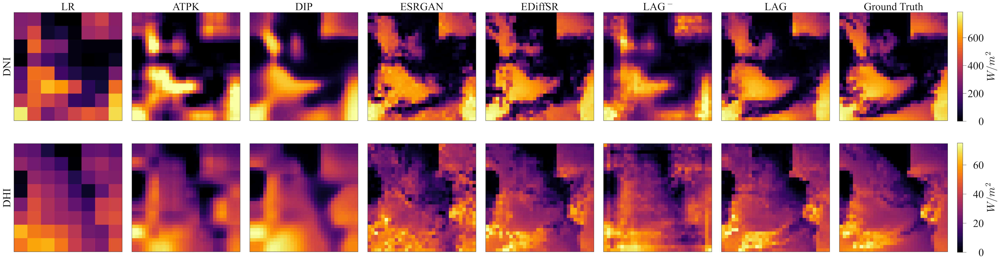
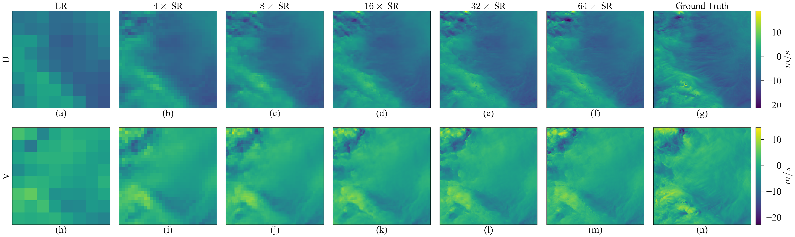

# Generative Adversarial Models for Extreme Geospatial Downscaling

[](https://arxiv.org/abs/2402.14049)

## Abstract

> Addressing the challenges of climate change requires accurate and high-resolution mapping of geospatial data, especially climate and weather variables. However, many existing geospatial datasets, such as the gridded outputs of the state-of-the-art numerical climate models (e.g., general circulation models), are only available at very coarse spatial resolutions due to the model complexity and extremely high computational demand. Deep-learning-based methods, particularly generative adversarial networks (GANs) and their variants, have proved effective for refining natural images and have shown great promise in improving geospatial datasets. This paper describes a conditional GAN-based stochastic geospatial downscaling method that can accommodate large scaling factors. Compared to most existing methods, the method can generate high-resolution accurate climate datasets from very low-resolution inputs. More importantly, the method explicitly considers the uncertainty inherent to the downscaling process that tends to be ignored in existing methods. Given an input, the method can produce a multitude of plausible high-resolution samples instead of one single deterministic result. These samples allow for an empirical exploration and inferences of model uncertainty and robustness. With a case study of gridded climate datasets (wind velocity and solar irradiance), we demonstrate the performances of the framework in downscaling tasks with large scaling factors (up to $64\times$) and highlight the advantages of the framework with a comprehensive comparison with commonly used and most recent downscaling methods, including area-to-point (ATP) kriging, deep image prior (DIP), enhanced super-resolution generative adversarial networks (ESRGAN), physics-informed resolution-enhancing GAN (PhIRE GAN), and an efficient diffusion model for remote sensing image super-resolution (EDiffSR).

## Highlights

- **Stochastic Extreme Downscaling:** We present a LAG-based framework for stochastic downscaling of gridded scientific datasets to address key challenges in geospatial downscaling, including large scaling factors, complex spatial patterns, mass preservation, and uncertainty;

- **Comprehensive Comparison:** We highlight the performances of the LAG-based framework in addressing the above challenges with a comprehensive comparison with commonly used and recent downscaling models;

- **Uncertainty Quantification:** We examine the uncertainty and robustness of the framework with a simulation-based approach and provide a hypothesis testing approach to quantify the reliability of model outputs.

## Overview


## Results

### $4\times$ Downscaling Comparison

**Solar irradiance (DNI & DHI)**



**Wind velocity (U & V)**


### Downscaling Results at Various Scales (up to $64\times$)

**Solar irradiance (DNI & DHI)**


**Wind velocity (U & V)**



## Installation

We recommend using Anaconda for package management. A GPU is highly recommended.

```bash
conda create -n LAG_Climate python==3.9
conda activate LAG_Climate
pip install -r requirements.txt
```

## Model training and testing

The datasets used in this project are gridded data of wind velocity and solar irradiance covering the continental United States, obtained from the National Renewable Energy Laboratory's (NREL's) [Wind Integration National Database (WIND) Toolkit](https://www.nrel.gov/grid/wind-toolkit.html) and the [National Solar Radiation Database (NSRDB)](https://nsrdb.nrel.gov/).

Pre-trained weights and corresponding model configurations can be found in `results/**/**/args` and `results/**/**/checkpoint`. Example data for training and testing are provided in the `data` folder. For training details, please see `train.py`, and refer to our Jupyter notebook [test.ipynb](test.ipynb) (also available on Google Colab) for generating test images.

```bash
python train.py --dataset_name Solar --lr 0.004 --batch_size 1 --epoch 15,15 --report_step 140000 --expid Solar/Solar_bs1_epoch15_lr4e-3_64X --reset True

python train.py --dataset_name Wind --lr 0.002 --batch_size 16 --epoch 30,30 --report_step 7000 --expid Wind/Wind_bs16_epoch30_lr2e-3_64X --reset True
```

## Citation

If you find this work helpful, please consider citing our paper:

```bibtex
@article{li2024generative,
  title={Generative Adversarial Models for Extreme Geospatial Downscaling},
  author={Li, Guiye and Cao, Guofeng},
  journal={arXiv preprint arXiv:2402.14049},
  year={2024}
}
```

Feel free to open an Issue if you need any assistance or have any questions.